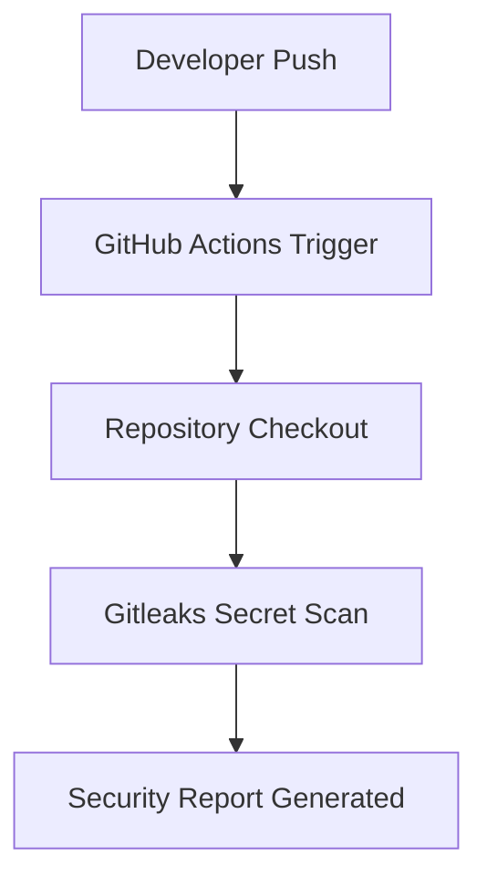
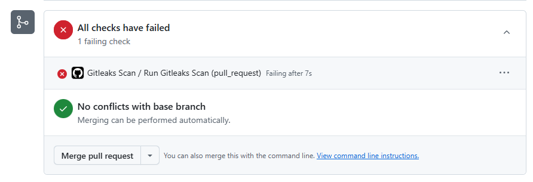

# Secret Detection with GitHub Actions and Gitleaks

## Project Overview

Hardcoded secrets such as API keys, tokens, and credentials are one of the most common security issues in modern development.

This project demonstrates how secret detection can be automated in a CI/CD pipeline using GitHub Actions and Gitleaks.

The workflow scans commits and pull requests to detect sensitive information before it is merged into the main branch.

## Why Secret Scanning Matters

Accidentally committing secrets to a repository can lead to serious security risks including:

- Unauthorized access to APIs
- Credential leaks
- Infrastructure compromise
- Supply chain attacks

Automated secret scanning helps prevent these issues by identifying exposed secrets during development.

## Workflow

The security scan runs automatically when:

- Code is pushed to the main branch
- A pull request is opened against main
- The workflow is manually triggered



## Codebase Explained
This project uses a YAML workflow file to define an automated security scan using GitHub Actions.

The workflow specifies the triggers, environment, and steps required to run a Gitleaks scan against the repository to detect potential hardcoded secrets.

---

The first part of the YAML file defines the workflow name and specifies when the action should run.

In this case, the scan runs when a **pull request targets the main branch**, when changes are pushed directly to the **main branch**, or when the workflow is manually triggered using **workflow_dispatch**.

```
name: Gitleaks Scan
on:
    pull_request:
        branches:
            - main
    push:
        branches:
            - main
    workflow_dispatch:
```
---

## Defining the Jobs and Steps
```
jobs:
    scan:
        name: Run Gitleaks Scan
        runs-on: ubuntu-latest
        steps:
            - name: Checkout code
              uses: actions/checkout@v3
              with:
                fetch-depth: 0
            - name: Run Gitleaks Action
              uses: gitleaks/gitleaks-action@v2
              with:
                args: git --log-opts $(git merge-base origin/main HEAD)..HEAD --report-format sarif --report-path gitleaks.sarif
              env:
                GITHUB_TOKEN: ${{ secrets.GITHUB_TOKEN }}
```


This final part of the YAML file defines the jobs that we want to run. First, we set a friendly name and define where the job will run. 

In this case it runs on `ubuntu-latest`, which you can think of as the server environment the workflow executes on.

Next we define the steps that should take place.

The first step checks out the repository code so the scanner can properly inspect it.

As part of the checkout we set `fetch-depth: 0`. 

This ensures that the full commit history is downloaded rather than just the most recent commit. This allows the scan to check across the full history for potential leaks so nothing is missed.

The second step pulls the Gitleaks GitHub Action so it can run the scan.

For security reasons we pin the action to a specific version:

`uses: gitleaks/gitleaks-action@v2.3.9`

Pinning versions is a good security practice. If a vulnerability is discovered in the action, we can easily see which version we are using and update it if necessary. 

It also helps reduce supply chain risk by not blindly pulling whatever code happens to exist on the latest branch.

The `args` flag defines how Gitleaks should run. Instead of scanning the entire repository every time, it scans the commit range between the merge base of `origin/main` and the current `HEAD`. 

This means the scan focuses only on the changes introduced by the branch.

Finally, `GITHUB_TOKEN: ${{ secrets.GITHUB_TOKEN }}` provides the action with the permissions it needs to run within the repository and report results.

--- 
## Testing the Action

After setting up the repository and configuring the GitHub Actions workflow, the next step was to verify that the pipeline triggered correctly and that the scan could successfully detect exposed secrets.

To test this, I created a `.env` file containing dummy API keys and committed it to a feature branch. I then opened a pull request to the `main` branch to trigger the workflow.

This allowed me to confirm that the action was executed at the defined trigger points in the YAML file and that the Gitleaks scan correctly detected the test secrets.

## Scan Results
The scan successfully detected the exposed credentials and caused the workflow to fail. Notifications were visible in the GitHub Security dashboard, the pull request checks, and via email.


---

## What I Learned

Although this project is relatively basic, it helped me understand how GitHub Actions workflows are structured and how to control when and how they execute. 

I learned how to define workflow triggers (such as pushes and pull requests), configure job steps, and manage important options like `fetch-depth` to control how much of the repository history is available during the scan.

I also gained a better understanding of version pinning for GitHub Actions (for example, specifying exact action versions). Using fixed versions is an important security practice, as it helps prevent unexpected changes or potential supply chain risks introduced by automatically updated dependencies.

Overall, this project strengthened my understanding of automation, CI/CD security practices, and how security tools can be integrated directly into the development workflow.

## What I Would Improve

To enhance this project, I would integrate a Static Application Security Testing (SAST) scanner to analyse the codebase for potential vulnerabilities and provide deeper security insights beyond secret detection.

I would also consider building a simple security dashboard to visualise scan results, track failures over time, and clearly display the reasons for each failure. This would improve visibility and make the security pipeline easier to monitor and interpret.
